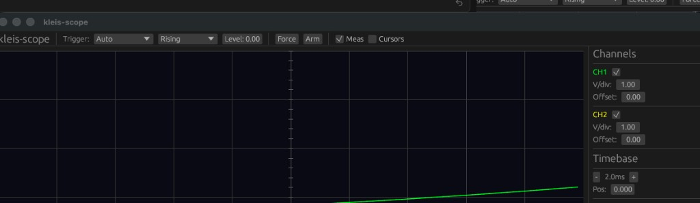
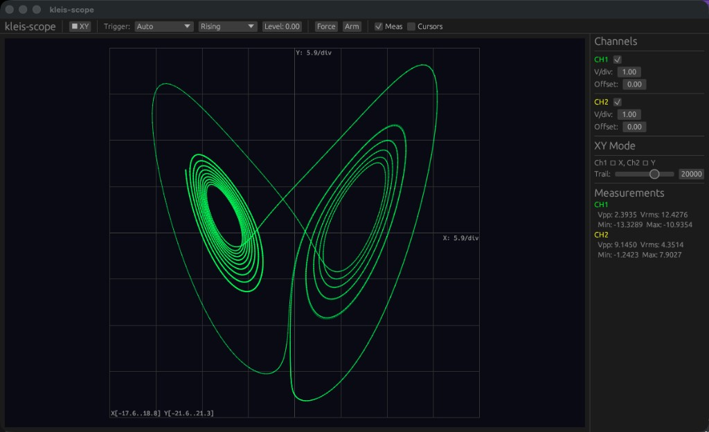

# kleis-scope

Standalone oscilloscope that consumes streams of numbers — just like a real scope.





## Quick Start

```bash
# Build
cargo build --release -p scope-native

# Pipe CSV data from any source
python3 scripts/generate_test_signal.py | ./target/release/kleis-scope --stdin --channels 2 --rate 1000

# Lorenz strange attractor in XY mode
python3 scripts/lorenz_attractor.py | ./target/release/kleis-scope --stdin --channels 2 --rate 5000 --xy

# Stream from Kleis simulation
kleis simulate_graph --output - | ./target/release/kleis-scope --stdin --channels 2 --rate 10000

# Connect to a WebSocket
./target/release/kleis-scope --ws ws://localhost:9100 --channels 4 --rate 44100

# Tail a growing file
./target/release/kleis-scope --file data.csv --channels 2 --rate 1000
```

## Architecture

```
kleis-scope/
  crates/
    scope-core/       # Shared library: ring buffer, trigger, timebase, measurements, FFT
    scope-native/     # Desktop app (egui/wgpu)
    scope-web/        # WASM build (egui + glow)
  scripts/
    generate_test_signal.py   # Sine wave test data
    lorenz_attractor.py       # Lorenz strange attractor (RK4)
```

## Display Modes

- **YT mode** (default) — traditional time-domain display with horizontal sweep
- **XY mode** (`--xy`) — plots Ch1 on the X axis and Ch2 on the Y axis, auto-scaled with phosphor trail. Perfect for Lissajous figures, phase portraits, and strange attractors.

## Input Format

CSV with one sample frame per line:

```
ch0, ch1, ch2          # no timestamp — uses declared sample rate
0.001, 1.5, 2.3, -0.7  # with --has-timestamp: first column is time
```

Lines starting with `#` are ignored.

## Features

- 4-channel display with phosphor-style traces
- XY mode with auto-scaling and phosphor fade trail
- Trigger: Auto / Normal / Single, rising/falling edge
- Measurements: Vpp, Vrms, frequency, period, rise/fall time
- Time and voltage cursors with delta readout
- Math channel: add, subtract, multiply, FFT spectrum
- Export: CSV, Typst plot source
- Input backends: stdin, WebSocket, TCP, file tail
